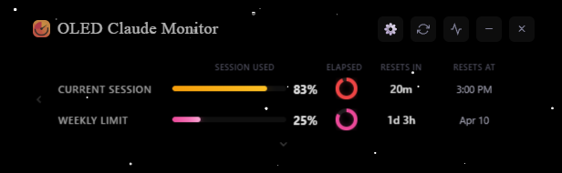
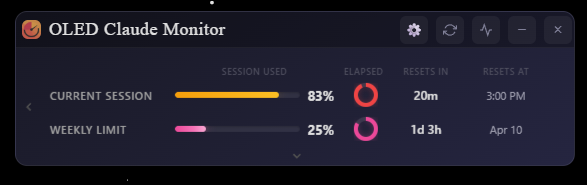
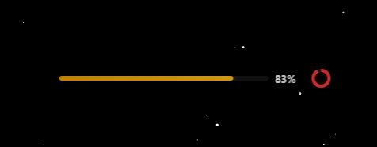
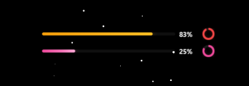
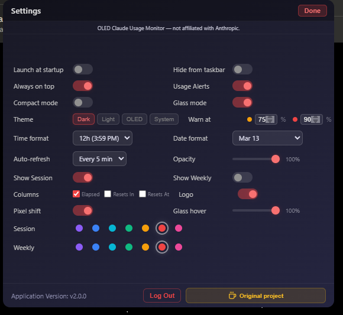

# OLED Claude Usage Monitor Widget

A desktop widget for real-time **Claude.ai** usage monitoring, built with Electron. Designed for OLED displays with burn-in prevention, transparent glass mode, and full accent color customization.

> Fork of [Claude Usage Widget](https://github.com/SlavomirDurej/claude-usage-widget) by Slavomir Durej. See [CREDITS.md](CREDITS.md) for attribution.

---

## Features

### Display Modes
- **Dark / Light / OLED** themes with full accent color support
- **Glass mode** — fully transparent background, only progress bars and data visible. Title bar and labels appear on mouse hover with configurable opacity
- **Compact mode** — minimal two-bar view (290px wide)

### OLED Protection
- **Pure black backgrounds** (#000000) to save power and prevent burn-in
- **Pixel shift** — subtle content drift animation that prevents static elements from burning into the panel
- Dimmed UI elements and reduced glow effects

### Customization
- **Dual accent colors** — separate color for Session and Weekly bars (purple, blue, cyan, green, orange, red, pink)
- **Window opacity** slider (20%-100%)
- **Glass hover opacity** — controls how visible hidden elements become on hover
- **Column toggles** — show/hide Elapsed, Resets In, Resets At columns
- **Row toggles** — show/hide Current Session or Weekly Limit
- **Claude logo** toggle next to session label

### Monitoring
- Session and weekly usage with progress bars and circular timers
- Extra usage tracking (overage spending, prepaid credits)
- 7-day usage history graph
- Desktop notifications at configurable warning/danger thresholds
- Auto-refresh (15s to 5min)
- Session and weekly reset countdown timers

---

## Installation

### Quick Start (Windows)

1. Install [Node.js](https://nodejs.org/) (LTS version)
2. Clone this repo:
   ```
   git clone https://github.com/kucharko/oled-claude-usage-monitor.git
   cd oled-claude-usage-monitor
   ```
3. Run the installer:
   ```
   install.bat
   ```
   Choose option 1 to run immediately, or option 2 to build a Windows installer (.exe).

### Manual

```
npm install
npm start
```

### Build Windows Installer

```
npm run build
```

Output in `dist/` folder — NSIS Setup .exe + portable .exe.

---

## Setup

1. Launch the app
2. Click **Log in** to authenticate via Claude.ai, or use **Manual** to paste your session key
3. Open Settings (gear icon) to customize theme, accents, columns, and display options

### Getting a Session Key (Manual)

1. Open [claude.ai](https://claude.ai) in your browser
2. Press `F12` to open DevTools
3. Go to **Application** tab > **Cookies** > `https://claude.ai`
4. Copy the value of `sessionKey`

---

## Screenshots

### OLED Theme


### Dark Theme


### Glass Mode




### Settings


---

## Tech Stack

- **Electron 41** — desktop framework (Chromium 136)
- **Chart.js** — usage history graph
- **electron-store** — settings persistence (OS keychain encrypted)
- **Vanilla JS** — no frontend framework dependencies

---

## Credits

Based on **[Claude Usage Widget](https://github.com/SlavomirDurej/claude-usage-widget)** by **Slavomir Durej**.

This fork adds OLED display support, glass mode, dual accent colors, pixel shift protection, column/row visibility controls, and various UI improvements. See [CREDITS.md](CREDITS.md) for full attribution.

---

## License

MIT (as declared in the original project's package.json). See [CREDITS.md](CREDITS.md) for details.
